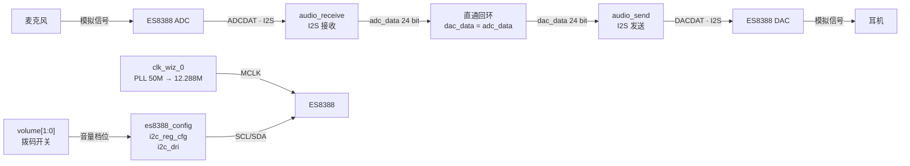
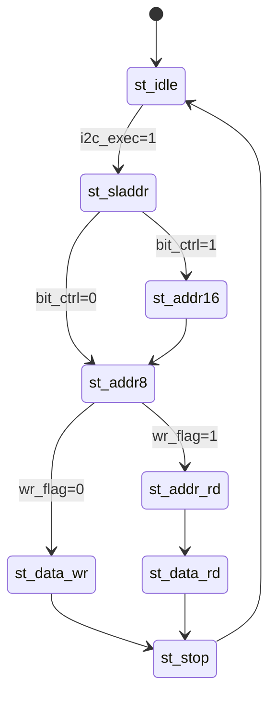

# EG4S20BG256 + ES8388 音频回环系统

基于 **安路（Anlogic）EG4S20BG256** FPGA 开发板与 **ES8388** 音频编解码器实现的一个音频回环（Loopback）Demo：麦克风输入 → ADC 采集 → FPGA 直通 → DAC 输出到耳机，实现“边说话边听自己”的效果。

纯 Verilog RTL 实现，不依赖任何软核 CPU，ES8388 的寄存器配置、I2S 收发、I2C 驱动全部由 FPGA 逻辑完成。

## ✨ 功能特性

- **麦克风 → 耳机音频回环**：`adc_data` 直连 `dac_data`，输入即输出
- **I2S 音频接口**：24-bit I2S 格式，48 kHz 采样率
- **主时钟由 FPGA 提供**：PLL 由 50 MHz 系统时钟生成 12.288 MHz 的 `MCLK` 送给 ES8388
- **纯逻辑 I2C 配置**：三段式状态机驱动，上电自动配置 ES8388 的 24 个寄存器，无需外部 MCU
- **数字音量调节**：2 位拨码开关选择耳机输出音量（4 档）
- **锁定指示**：PLL 锁定后点亮板载 LED

## 🔧 硬件平台


| 器件         | 型号                      | 说明                       |
| ------------ | ------------------------- | -------------------------- |
| FPGA         | 安路 EG4S20BG256          | 主控，EG4 系列             |
| 音频编解码器 | ES8388                    | 单芯片双通道 ADC/DAC       |
| 开发工具     | 安路 TangDynasty（TD）5.6 | 综合、布局布线、生成比特流 |

ES8388 模块与 FPGA 通过 **I2S**（`MCLK / BCLK / LRC / ADCDAT / DACDAT`）与 **I2C**（`SCL / SDA`）两组接口连接，具体插接方式见 `ES8388 Module/硬件连接说明.docx`。

## 📁 目录结构

```
es8388_EG4S20/
└── es8388/
    ├── RTL/                     # 全部 Verilog 源码
    │   ├── audio_speak.v        # 顶层模块（回环连接 + PLL 例化）
    │   ├── es8388_ctrl.v        # ES8388 控制模块（例化配置/接收/发送）
    │   ├── es8388_config.v      # I2C 寄存器配置调度
    │   ├── i2c_reg_cfg.v        # 配置序列生成（24 组寄存器、音量档位）
    │   ├── i2c_dri.v            # I2C 总线驱动（三段式状态机）
    │   ├── audio_receive.v      # I2S 音频接收（ADC 采集）
    │   ├── audio_send.v         # I2S 音频发送（DAC 输出）
    │   └── pll_clk.v            # PLL 封装（工程实际使用 TD 的 clk_wiz_0 IP）
    └── TD/
        ├── ES8388.al            # TD 工程文件（器件、文件、顶层）
        ├── ES8388.adc           # 引脚约束
        ├── al_ip/clk_wiz_0.ipc  # 时钟 IP（50M → 12.288M）
        └── ES8388_Runs/phy_1/ES8388.bit   # 已生成的比特流
```

## 🏗️ 系统架构



**数据通路**：`audio_receive` 在 `BCLK` 时钟域下从 ES8388 的 `ADCDAT` 采集 24-bit I2S 数据，得到 `adc_data`；顶层将 `adc_data` 直接接到 `audio_send` 的 `dac_data`，由 `audio_send` 按同样的 I2S 时序从 `DACDAT` 送回 ES8388，实现零延迟回环。

**控制通路**：上电后 `i2c_reg_cfg` 依次产生 24 组「寄存器地址 + 数据」，交给 `i2c_dri` 状态机通过 I2C（从机地址 `0x10`，SCL 250 kHz）写入 ES8388，完成 ADC/DAC 的电源、时钟、采样率、字长、增益等配置。

## 🔌 I2C 驱动设计

I2C 配置链路是本项目的核心模块之一，采用**分层 + 三段式状态机**的结构，将「寄存器要写什么」与「I2C 总线怎么走」彻底解耦：


| 层级   | 模块              | 职责                                                        |
| ------ | ----------------- | ----------------------------------------------------------- |
| 调度层 | `es8388_config.v` | 例化下层模块，定义从机地址、字长、时钟频率等参数            |
| 数据层 | `i2c_reg_cfg.v`   | 产生 24 组「寄存器地址 + 数据」配置序列，处理音量/字长映射  |
| 总线层 | `i2c_dri.v`       | 纯 I2C 时序状态机，负责 START/STOP/ACK/读写，与具体器件无关 |

### 三段式状态机

`i2c_dri.v` 用三段式 FSM 实现，8 个状态采用独热编码：



- `st_sladdr`：发送 7-bit 从机地址 + R/W 位，等待从机 ACK
- `st_addr16` / `st_addr8`：发送 16/8-bit 寄存器字地址（由 `bit_ctrl` 选择）
- `st_data_wr`：写 8-bit 数据，等待从机 ACK
- `st_addr_rd`：重复起始（Repeated Start）+ 从机地址 + 读位
- `st_data_rd`：读 8-bit 数据，主机发 NACK 结束
- `st_stop`：产生停止条件

### 时序设计

- **SCL 频率**：250 kHz，由 `I2C_FREQ` 参数指定
- **驱动时钟 `dri_clk`**：SCL 的 4 倍频（1 MHz），每个 bit 用 `cnt` 计数器精确控制——SCL 低电平期间翻转 SDA，高电平期间保持稳定，满足 I2C 建立/保持时间要求
- **分频系数**：`clk_divide = (CLK_FREQ / I2C_FREQ) >> 3 = (50M / 250k) / 8 = 25`，即 `clk_cnt` 计数 25 个 50 MHz 周期翻转一次 `dri_clk`

### 关键实现要点

- **SDA 双向三态**：`sda = sda_dir ? sda_out : 1'bz`，用方向控制位在主/从收发间切换，`sda_in` 用于读操作采样
- **从机应答（ACK）**：写完一个字节后释放 SDA（`sda_dir=0`），由从机在 SCL 第 9 个周期拉低应答
- **读操作**：用 Repeated Start 切换读写方向，读完后主机发 NACK（`sda_out=1`）结束
- **全参数化**：`SLAVE_ADDR` / `CLK_FREQ` / `I2C_FREQ` 均可参数传递，同一驱动可复用于其他 I2C 器件

## 🎛️ ES8388 寄存器配置


| 寄存器   | 地址       | 数值 | 功能                                   |
| -------- | ---------- | ---- | -------------------------------------- |
| R0       | 0x00       | 0x16 | ADC/DAC 采样率相同，使能 VREF/VMID     |
| R1–R4   | 0x01–0x04 | —   | 打开全部 / ADC / DAC 电源              |
| R8       | 0x08       | 0x80 | 主模式，MCLK 不分频，BCLK 自动         |
| R9       | 0x09       | 0x22 | 麦克风增益 6 dB                        |
| R12      | 0x0C       | 0x00 | ADC 24-bit I2S 模式                    |
| R13      | 0x0D       | 0x02 | ADC 采样率 = 12.288 / 256 = 48 kSPS    |
| R16/R17  | 0x10/0x11  | 0x00 | 左右 ADC 音量 0 dB                     |
| R18      | 0x12       | 0xF8 | ALC 与 PGA 增益范围                    |
| R23      | 0x17       | 0x00 | DAC 24-bit I2S 模式                    |
| R24      | 0x18       | 0x02 | DAC 采样率 = 48 kSPS                   |
| R26/R27  | 0x1A/0x1B  | 0x00 | 左右 DAC 音量 0 dB                     |
| R39/R42  | 0x27/0x2A  | 0xB8 | 左右 DAC Mixer 使能                    |
| R43      | 0x2B       | 0x80 | ADC/DAC 共用同一 LRC                   |
| R46–R49 | 0x2E–0x31 | 0x1A | 四路输出 −6 dB 衰减                   |
| R10      | 0x0A       | 0x00 | 输入选择：麦克风（改 0x50 为 Line-in） |

> 完整配置逻辑见 `RTL/i2c_reg_cfg.v`。

## 🔌 引脚分配


| 信号         | 方向  | 引脚 | 说明                     |
| ------------ | ----- | ---- | ------------------------ |
| `sys_clk`    | in    | R7   | 50 MHz 系统时钟          |
| `sys_rst_n`  | in    | A9   | 复位（低有效）           |
| `aud_mclk`   | out   | N5   | ES8388 主时钟 12.288 MHz |
| `aud_bclk`   | in    | M6   | ES8388 位时钟            |
| `aud_lrc`    | in    | M7   | 左右声道对齐信号         |
| `aud_adcdat` | in    | R14  | ADC 音频数据输入         |
| `aud_dacdat` | out   | P6   | DAC 音频数据输出         |
| `aud_scl`    | out   | R12  | I2C 时钟                 |
| `aud_sda`    | inout | R9   | I2C 数据                 |
| `volume[0]`  | in    | A10  | 音量选择低位             |
| `volume[1]`  | in    | B10  | 音量选择高位             |
| `led`        | out   | B14  | PLL 锁定指示             |
| `ilaclk`     | out   | T5   | 逻辑分析仪时钟（调试用） |

音量档位（`volume[1:0]` → 耳机输出音量）：


| volume[1:0] | 音量参数 |
| ----------- | -------- |
| 00          | 15       |
| 01          | 30       |
| 10          | 45       |
| 11          | 60       |

## 🚀 快速开始

1. **准备环境**：安装安路 TangDynasty（TD）软件（工程使用 5.6 版本）。
2. **打开工程**：用 TD 打开 `es8388/TD/ES8388.al`。
3. **综合与布线**：依次运行 Synthesis（`syn_1`）与 Physical Design（`phy_1`）。
4. **下载验证**：将生成的 `es8388/TD/ES8388_Runs/phy_1/ES8388.bit` 下载到开发板（工程内已附带一份编译好的比特流，可直接烧录）。
5. **测试**：将麦克风接 ES8388 的 MIC 输入、耳机接输出，上电后 `led` 点亮表示 PLL 已锁定，即可听到回环的音频；拨动 `volume` 拨码开关可调节耳机音量。

## 📚 参考文档

- `ES8388 Module/ES8388数据手册.pdf` — ES8388 芯片手册
- `ES8388 Module/ES8388声卡原理图.pdf` — ES8388 模块原理图
- `ES8388 Module/硬件连接说明.docx` — 硬件插接方式
- `EG4S20BG256核心板 - 2023.pdf` — 开发板原理图
- `EG4S20数据手册/` — 安路 EG4S20 系列资料（PLL、IO、块 RAM 等）

## 📄 许可证

本项目仅用于学习与交流，RTL 源码可自由参考；`pll_clk.v` 为工具自动生成的封装文件，请遵循对应 EDA 工具与 IP 的授权条款。
